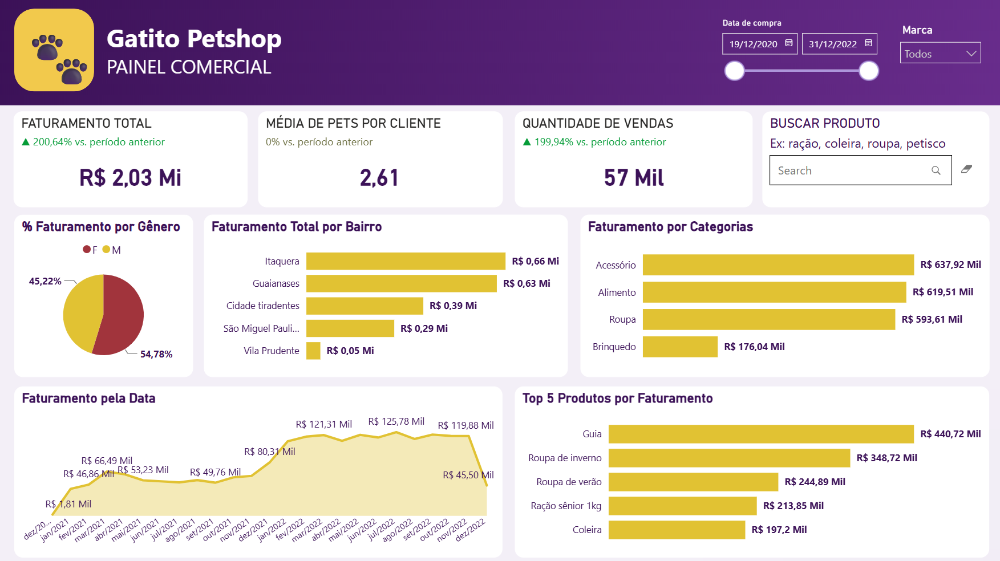

# 📊 Gatito Petshop — Painel Comercial & Inteligência de Vendas


---

## 📌 Contexto & Desafio de Negócio

A **Helô**, proprietária da **Gatitos Petshop** (localizada na Zona Leste de São Paulo), identificou uma oportunidade de expansão para o seu negócio e tem como objetivo estratégico a **abertura de novas filiais**. 

Para viabilizar essa expansão de forma segura e orientada por evidências, ela necessitava de uma solução analítica capaz de responder perguntas operacionais e táticas sobre o desempenho atual da loja, comportamento de consumo dos clientes e rentabilidade do portfólio de produtos.

Este dashboard foi criado com base nos dados do curso “Power BI Desktop: Construindo meu primeiro dashboard” da Alura.

---

## 🎯 Objetivo da Solução

Desenvolver um **Painel Comercial Executivo no Power BI** para transformar o histórico de vendas transacionais da Gatitos Petshop em inteligência acionável, permitindo:

1. **Avaliar a viabilidade e direção da expansão geográfica** com base na densidade e receita por bairro da Zona Leste.
2. **Identificar os produtos e categorias campeões de vendas** para otimização do controle de estoque e planejamento do mix de produtos das novas filiais.
3. **Mapear o perfil e comportamento dos clientes** (como a média de pets por cliente) para orientar campanhas de marketing, programas de fidelização e vendas cruzadas (*cross-selling*).

---

## 🖼️ Visualização do Dashboard



---

## 📈 Principais Métricas & Insights de Negócio

* **Onde abrir as novas filiais? (Expansão Geográfica):** 
  Os bairros de **Itaquera (R$ 0,66 Mi)** e **Guaianases (R$ 0,63 Mi)** concentram mais de 60% da receita total (**R$ 1,29 Mi** de R$ 2,03 Mi). Este dado indica uma base sólida e valida a Zona Leste como região prioritária para a abertura de novos pontos físicos ou centros de distribuição.

* **Qual o mix de produtos prioritário? (Gestão de Estoque):** 
  A categoria de **Acessórios (R$ 637,92 Mil)** supera até mesmo a de Alimentos, impulsionada pelo produto **"Guia"**, que sozinho gerou **R$ 440,72 Mil**. A nova filial deve nascer com alto estoque de acessórios e vestuário (roupas de inverno/verão somam R$ 593 Mil).

* **Como maximizar o LTV e Fidelização? (Comportamento do Cliente):** 
  Com uma média de **2,61 pets por cliente**, o modelo comercial possui forte tração. Recomendou-se a criação de kits para múltiplos pets e programas de assinatura de ração sênior/alimentos, aproveitando o volume de 57 mil vendas realizadas (**+199,94%** em relação ao período anterior).

---

## 🏗️ Arquitetura da Solução & Modelagem de Dados

A modelagem segue a arquitetura dimensional em **Star Schema (Esquema Estrela)** para otimização de performance e legibilidade dos dados.

* **`Clientes`**: Tabela dimensão originada do `Clientes.txt` contendo dados demográficos e geográficos.
* **`Produtos`**: Tabela dimensão originada do `Produtos_gatitos.xlsx` com categorias e descrições do portfólio.
* **`Calendario`**: Tabela dimensão temporal gerada via DAX para garantir suporte integral às funções de inteligência de tempo (*Time Intelligence*).
* **`Vendas`**: Tabela fato unificada contendo o histórico transacional consolidado do período.

---

## ⚙️ Processo de ETL (Power Query)

1. **Consolidação Transacional (`fVendas`):** Importação dinâmica da pasta de arquivos de vendas (`Gatitos_2020.xlsx`, `Gatitos_2021.xlsx` e `Gatitos_2022.xlsx`), combinando os binários, expandindo as tabelas e tratando tipos de dados.
2. **Tratamento & Limpeza:** Remoção de metadados e colunas técnicas desnecessárias originadas na extração dos sistemas de origem.
3. **Modelagem de Dimensões:** Importação e estruturação dos arquivos `Clientes.txt` e `Produtos_gatitos.xlsx`, assegurando chaves primárias e relacionamentos com integridade referencial.

---

## 🧮 Regras de Negócio & DAX

Todas as regras de negócio e indicadores de desempenho foram centralizados em uma tabela dedicada de medidas (`_Medidas`) para manutenção ágil e boa governança.

```dax
// Faturamento do Período Anterior
Faturamento Anterior = 
CALCULATE(
    [Faturamento Total], 
    SAMEPERIODLASTYEAR(Calendario[Data])
)

// Variação Percentual do Faturamento
Variação Faturamento % = 
DIVIDE(
    [Faturamento Total] - [Faturamento Anterior], 
    [Faturamento Anterior], 
    0
)

// Média de Pets por Cliente
Média Pets = 
DIVIDE(
    SUM(Clientes[Quantidade_Pets]), 
    DISTINCTCOUNT(Vendas[ID_Cliente]), 
    0
)

// Variação Percentual do Volume de Vendas
Variação Vendas % = 
DIVIDE(
    [Quantidade Vendas] - [Vendas Anterior], 
    [Vendas Anterior], 
    0
)

```

---

## 🎨 Desafio Técnico & Redesign Visual (UI/UX)

O principal desafio deste projeto foi **redesenhar o painel original para elevar o padrão estético e funcional da solução**.

* **Hierarquia Visual:** Aplicação de conceitos de UI/UX para agrupamento lógico dos indicadores em cartões e blocos (*Faturamento*, *Volume*, *Segmentação Geográfica* e *Mix de Produtos*).
* **Experiência do Usuário (UX):** Redução da carga cognitiva do tomador de decisão, destacando métricas prioritárias (*KPI Cards*) no topo e permitindo navegação através de filtros temporais e barra de busca interativa de produtos.

---

## 📁 Estrutura do Repositório

```text
.
├── dados/
│   ├── vendas/
│   │   ├── Gatitos_2020.xlsx
│   │   ├── Gatitos_2021.xlsx
│   │   └── Gatitos_2022.xlsx
│   ├── Clientes.txt
│   └── Produtos_gatitos.xlsx
├── Gatito_pet_shop.pbix
└── README.md

```

---

## 🚀 Como Executar o Projeto Localmente

1. Clone o repositório:
```bash
git clone [https://github.com/seu-usuario/gatito-petshop-powerbi-analytics.git](https://github.com/seu-usuario/gatito-petshop-powerbi-analytics.git)

```


2. Abra o arquivo `Gatito_pet_shop.pbix` no Power BI Desktop.
3. Caso necessário, atualize o caminho dos arquivos da pasta `dados/` nas configurações da fonte de dados no Editor do Power Query.

---

## 👨‍💻 Autor

**Vinícius Cunha**

*Profissional de Dados, BI & Analytics*

LinkedIn: https://www.linkedin.com/in/viniciuscunhadata

GitHub: https://github.com/vcbonani

```

```
